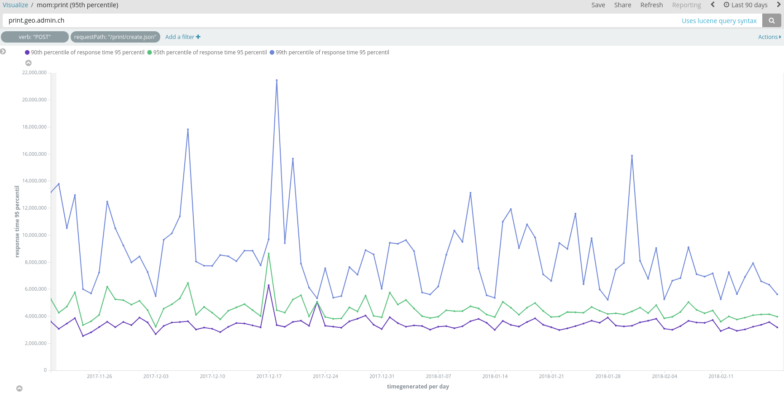
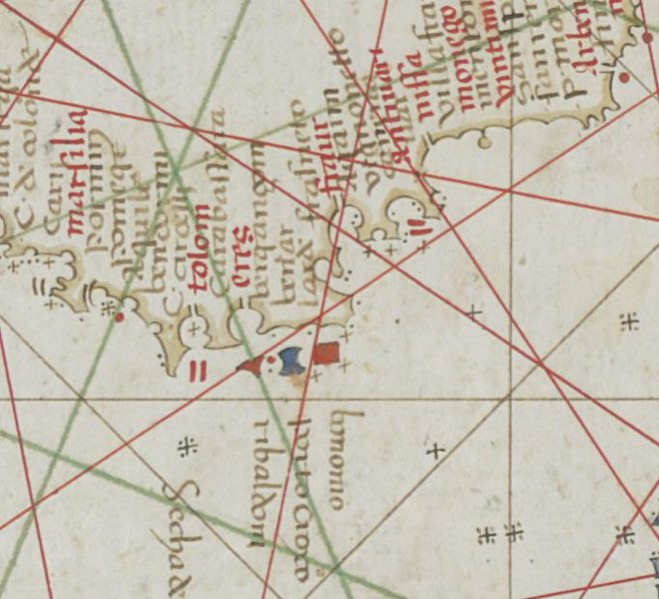
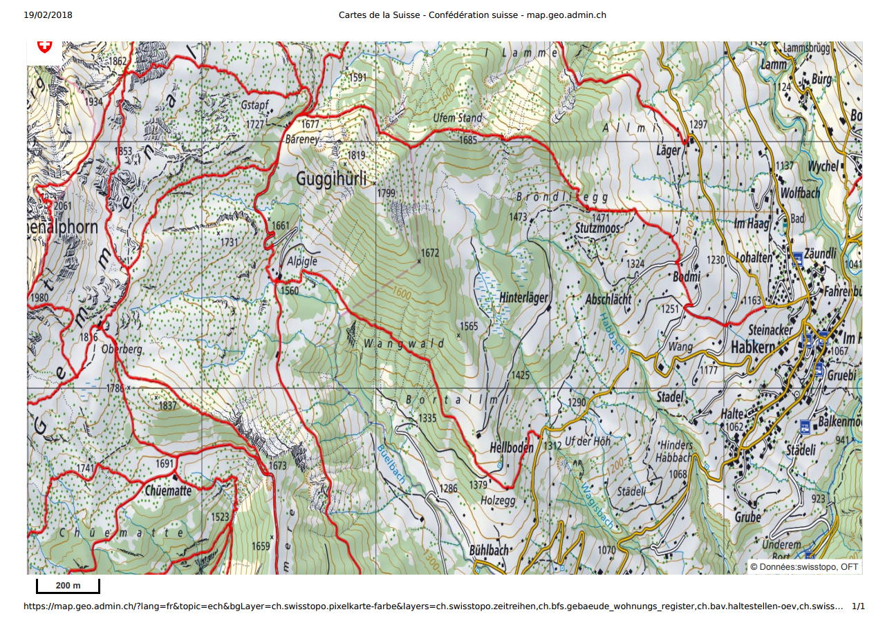
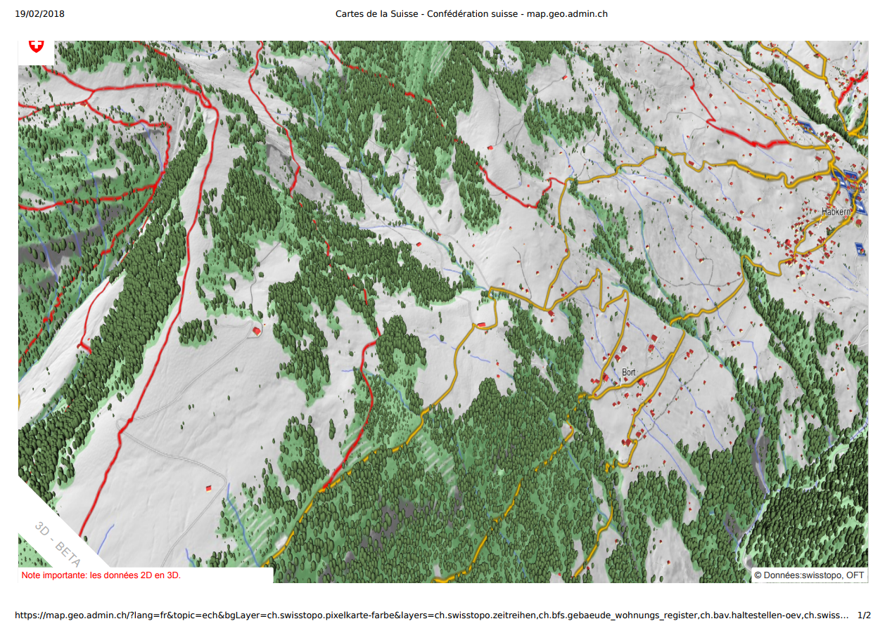

**Abstracts**

_This document explores various alternatives for generating suitable document for printing to be used in a web mapping application._

Current situation
=================

The swiss federal geoportal [map.geo.admin.ch](https://map.geo.admin.ch) uses a customed developped server-side printing application ([service-print]((https://github.com/geoadmin/service-print)) based on a [forked](https://github.com/geoadmin/mapfish-print/tree/2.1.x_geoadmin3) of [MapFish Print v2](http://www.mapfish.org/doc/print/) and a [Python Flask](http://flask.pocoo.org/) application to allow for multiserver use and multipage PDF document generation. Currently, it runs in a Docker auto-scalling group, with one server at night and two during the day.

## Capabilities

* Printing all 2D layers from map.geo.admin.ch, including import GPX/KML and most WMTS/WMS 
* Generating an A4/A3 PDF 1.3 at 150 DPI (not a technical limitation)
* Generating a multipage PDF for Zeitreise (one year per page)
* Synchronous print for single page, asynchronous for multipage
* 247'198 PDF page generated the last 90 days (500-5'000 per day) and 1'383 multipage print (0 to 50 per day)
* Dockerized application running on a auto-scaling cluster (time-based)
* Using an extend version of the standar print procotol used by GeoMapFish/GeoExt/GeoServer
* Merging legends of complex layers (geology) to the end of the PDF document.

## Shortcomings

* Print only 2D map
* Imported WMS and WMTS layers won't be printed if remote server do not support LV95 projection (EPSG:2056).
* WMTS layers are added as indivual tiles to PDF, for every layers (way too much information if some layer are fully opaque) 232 MB for Zeitreise only, 376MB (25 pages)
* Very limited support for Vector. Luckily, imported vector do not support many style
* Symbols size for Raster layer (Vector symbol are adapted to print resolution)
* MapFish v2 is not developped anymore. swisstopo is patching a fork.

## Performances

The 95th percentile for all print jobs are between 3.7 and 5.0 s (only time for generation, without download)

{ width=250px }\

https://kibana.bgdi.ch/goto/3566fae450682eea244826f2ec49e477

Printing a [standard A4 landscape page at 1:25'000](https://github.com/procrastinatio/mapfish-print-examples/blob/master/specs/lv95_versoix_25000_simple.json)

Generation time (POST to response): 1.14 ± 0.19 s (n=256, every 5 minutes)

Error rate: last month 1'082 errors for 97'988 success (about 1.09%)

What is printing?
================

In the context on web mapping application, printing is generally seen as as a way to generate a file, like an image or a PDF, suitable to be sent to an office printer.
But even in this context, some people may primarly interested in the PDF file, not a paper impression. This is a huge difference.

This is a bit restrictive, as PDF file may be also saved for offline use. The advent of 3D data and application, also brings new possiblities and challenges.

What should be printed?
======================

Since its inception, maps have been decorated with more or less useful features.

{width=250px}\

Map data
--------

### 2D

#### Raster
Source are generally satelite/aerial imagery, and scan of legacy maps (historical maps)
Served usually as WMS and WMTS

#### Vector
Vector are now a few layer as GeoJSON, and imported GPX and KML

Question: rasterize data to print seems obvious, but it is definitely a loss of information.

  * Sync between server tools and

### 3D

* To convert to 2D or not? If so, rasterize or not?
* Render as 3D (export ?) for use with 3D printer or anything else (virtual world, KML, etc.)

### Time (4th dimension)

* Data changing over time (Zeitreise)
* Position changing over time (fly path)

How to render: multipage, movie?

Another challenge: mixing data with different rate of change and/or lacking data.

Non map data
------------

Non-map data provide useful informations

### Logo and corporate identity

Important or not, it gives a professinal look

### Disclaimer/copyright

Providing a clear delimitation between data which are from the geoportal and which data are 3rd party. Some remainder of copyright use.

### Title, note by user

Provide the user to give its work a title and notes

### Legend to the map

Some data are more complexe, and need an explanation. It could be as _simple_ as displaying the classification to a full grown geological explanation of the map.
 
### Scale, scalebar, norh arrow
Useful information for the orientation, and when hiking.

### QRcode, shortlink
Useful to recreate the map in the application online

### Table data (reporting)
Some infomarmation be easier to display as table. Not used in map.geo.admin.ch, but proposed by some printing application

### File metadata (if applicable)
Metadata are something useful for search engine if the main goal is to store the PDF.

### Grid
Various geographical grids, for orientation and use with GPS.

### Information on elements displayed
Could be the location of a search term in the simpliest form or additional information on a highlighted object (tooltips,etc.)

Tools, building bricks
======================

Browser
-------

### Rasterizing

HTML5, _toBlob()_, _toDataURL()_

### Export canvas to a vector format

As SVG or PDF (what libraries?)

Server-side rendering of GIS data
---------------------------------

Either vector or raster.

### Rasterizing of canvas

Challenges:
* Pretty slow
* How do you know the map is fully loaded and rendered?

#### SlimerJS (Firefox based)
* WebGL
* Not truely headless (?)

#### PhantomJS (WebKit based)
* No WebGL support

### Rasterizing/exporting data

#### Mapserver

[Cartographical Symbol Construction with MapServer][]

Mapserver is hower able to render to vector format like SVG and PDF (when using [PDFlib][])

#### Mapnik

Map Markup Language file) is a YAML or JSON
Mapnik XML, Cascadenik MML, Carto MML 
[Mapnik][] was the original tool to generate [OSM][] tiles for the so-called slippy map. Mapnik is also able to genrate PDF when compiled with [Cairo][].

It uses [Mapnik XML][] as configuration, also for styles. [Cascading Sheets Of Style for Mapnik][Cascadenik] aka [Cascadenik][] is a preprocessor for Mapnik, using cascading style sheet for map definition.
 
[CartoCSS] is a language for map design. It is similar in syntax to CSS, but builds upon it with specific abilities to filter map data and by providing things like variables. It targets the Mapnik renderer and is able to generate Mapnik XML or a JSON variant of Mapnik XML.

It is now deprecated ([The end of CartoCSS]) by its parent company, [Mapbox][].

#### Tileserver GL

A [Mapbox Style Specification][] is a document that defines the visual appearance of a map: what data to draw, the order to draw it in, and how to style the data when drawing it. A style document is a JSON object with specific root level and nested properties. This specification defines and describes these properties.

Vector and raster maps with GL styles. Server side rendering by Mapbox GL Native. Map tile server for Mapbox GL JS, Android, iOS, Leaflet, OpenLayers, GIS via WMTS, 
[Tileserver GL]

* GDAL/Rasterio
* OWSlib

Print server
------------

### Mapfish print

The purpose of [Mapfish Print 3] is to create reports that contain maps (and map related components) within them.
The project is a Java based servlet/library/application based on the mature [Jasper Reports Library][].

### Geoserver print

The [Geoserver Printing Module][] allows easy hosting of the Mapfish printing service within a GeoServer instance. The Mapfish printing module provides an HTTP API for printing that is useful within JavaScript mapping applications. User interface components for interacting with the print service are available from the Mapfish and GeoExt projects.

Integrated print tools
----------------------

Need more testing...

### QGIS print

### ArcGis print

ArcGIS Enterprise includes a geoprocessing service called PrintingTools. Web applications invoke the PrintingTools service and get a printable document in return (see [Printing in Web application][]):

 

Other considerations
====================

## Scale and resolution
Are scale and print quality of the result important?

## WebGL

## Vectors in PDF
Must vector layers rendered as vector or must be rasterized?

## Need for User defined style

With vector data, it is easy to apply user defined style, though defining styles for complexes dataset is a daring undertaking.

## PDF standard
Support of PDF/2 or PDF/A? No, open source library available. See [PDFlib][].  Not possible in the client

## Legacy client
For some legacy client, we must eventually also provide raster tiles (from vector layer)?

## Vector style definition

How are the styles for vector layer defined? Where? And how it is applied?

Currently, all style are defined in Mapserver's [Mapfile definition](https://github.com/geoadmin/wms-mapfile_include).

## Complexe symbols

Especially complexe labels placement is hard (what to render, at what scale, collision avoidance)

## Mashup

Maps should be mashed up with other sorts of infos (diagram, plot, data tables)

## Movie
Zeitreise, Fly along path, etc.

## Compute power

Externalize compute power on client or not?

## Performance
Synchronous or asynchronous printing

## WYSIWIG
Symbol scaling, which LK to use, grid display, etc.

## Grid
Grid for various projection system

## Projection issue

One selling point of vector tiles and 3D is that 2D in only a special case when pitch is 0 (or 90°). But the 3D world is a WGS1984 only world, which translate in the infamous [Equirectangular (or plate carrée)projection ](http://proj4.org/projections/eqc.html).
Using the same projection for printing as in the browser (projection of the data, target projection). When using a Webmercator, deformation, scale, with LK

## Rasterize as a data protection tool

Rasterizing vector data was also a way to _protect_ the more valuable original vector datasets (_e.g._WMS).

## Export to other format
Only PDF, os as image

## Use on smartphone and tablet

## Printing API
Provinding an API for 3rd party

## Multiserver use, autoscaling, etc.

## KMZ with local file

## GeoPDF

Approaches
==========

Client side printing
--------------------

Printing in 2D

\

Printing in 3D

\

### CSS: @media print

### Popup

HTML template for printing

### PDF generation in client

[PDF.js] (Open Source) and [jsPDF] (commercial), [PSPDFKit] (comercial)

### Examples

[Mapbox GL](https://www.procrastinatio.org/print-maps/) using [print-maps](https://github.com/mpetroff/print-maps) by Matthew Petroff.

[Cesium and swisstopo terrain](https://codepen.io/procrastinatio/full/c9fbe1b5f412adac74ee0944fd975511/)

### Discussions

#### Browser support

#### Workload is offloaded to clients

#### Raster only

Raster only, but smaller images

#### WYSIWIG (or almost)

#### No special code for rendering

#### Resolution

Basically, your get the canvas at dispostion. Some are trying to get a lager image by recreating a large hidden map canvas. It may work in 2D, but will consume much resource in 2D. Remember, A4 at 150 dpi is 1750x 1250px, and A3 at 150 DPI is 1750x2480px.

#### Templating

#### Performance

Hard to find when the page is fully rendered...

#### Security

Cross-Origin Resource Sharing (CORS) and Content-Security-Policy (CSP) 

### Conclusion

If the added value is not much more than what a screenshot offers, there not point to provide this functionality

Server side
-----------

Mixed approach
--------------
Some elements are rendered client-side and then sent to the server, or only some operation are done server-side.

Integrated approach
-------------------

Tools like QGis and ArcGIS used to configure the layers. Configuration files, including styles, are used in the web application.
As both client and server are using the same configuration, printing may be done server-side.

Discussion
==========

Conclusion
==========

[PDF.js]: https://mozilla.github.io/pdf.js/
[jsPDF]: https://parall.ax/products/jspdf
[PSPDFKit]: https://pspdfkit.com/pdf-sdk/web/

[print-maps]: https://github.com/mpetroff/print-maps

[Tileserver GL]: http://tileserver.org/

[OSM]: https://www.openstreetmap.org/ "OpenStreetMap"
[Mapserver]: http://mapserver.org/
[Cartographical Symbol Construction with MapServer]: http://mapserver.org/mapfile/symbology/construction.html
[Mapnik]: http://mapnik.org/
[Mapnik XML]: https://github.com/mapnik/mapnik/wiki/XMLConfigReference
[Cascadenik]: https://github.com/mapnik/Cascadenik
[Mapbox Style Specification]: https://www.mapbox.com/mapbox-gl-js/style-spec/
[The end of CartoCSS]: https://blog.mapbox.com/the-end-of-cartocss-da2d7427cf1
[CartoCSS]: https://cartocss.readthedocs.io/en/latest/
[Mapbox]: https://www.mapbox.com
[Cairo]: https://cairographics.org/
[PDFlib]: https://www.pdflib.com/
[MapFish Print 2]: http://www.mapfish.org/doc/print/
[MapFish Print 3]: https://mapfish.github.io/mapfish-print-doc/#/overview
[Jasper Reports Library]: https://community.jaspersoft.com/project/jasperreports-library
[Geoserver Printing Module]: http://docs.geoserver.org/latest/en/user/extensions/printing/index.html
[Printing in Web application]: https://enterprise.arcgis.com/en/server/latest/create-web-apps/windows/printing-in-web-applications.htm 

**Colophon**

This document was created with [pandoc](http://pandoc.org), with the following commands:
   

    $ pandoc -f markdown --latex-engine=xelatex   --number-sections \ 
      --variable mainfont="Gentium"   -V fontsize=10pt   "README.md" \
      --toc -o "web-map-printing.pdf"

