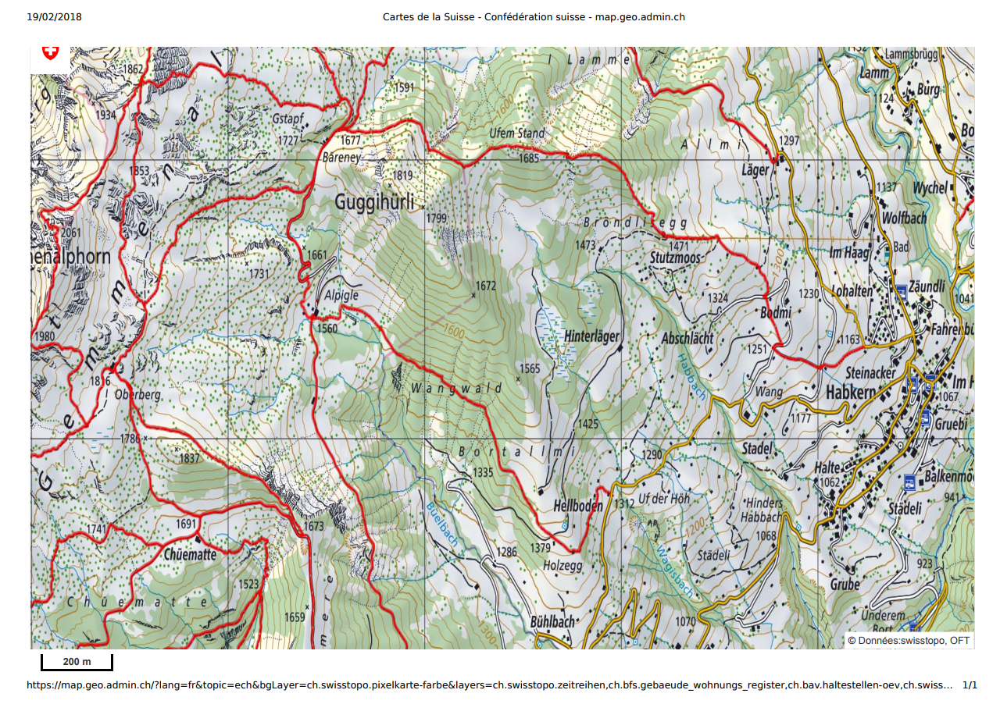

**Abstracts**


_This document explores various alternatives for generating suitable document for printing to be used in a web mapping application, with emphasis on the client side. _


The mother of all web mapping application, in 1993

{ width=250px }\


Current situation
=================

The Swiss federal geoportal [map.geo.admin.ch](https://map.geo.admin.ch) uses a customed developed server-side printing application ([service-print]((https://github.com/geoadmin/service-print)) based on a [forked](https://github.com/geoadmin/mapfish-print/tree/2.1.x_geoadmin3) of [MapFish Print v2](http://www.mapfish.org/doc/print/) and a [Python Flask](http://flask.pocoo.org/) application to allow for multiserver use and multipage PDF document generation. Currently, it runs in a Docker auto-scaling group, with one server at night and two during the day.

Print dialog and print extent as implemented in [map.geo.admin.ch][]:

\

The application is basically a proxy, no geodata are store locally. It receives a specification file, describing the extent, the layers (and how to get them), various text and flags, requests all geodata it needs and assembles a PDF document.

## Capabilities

* Printing all 2D layers from map.geo.admin.ch, including import GPX/KML and most WMTS/WMS 
* Selecting a predefined scale (from 1:500 to 1:2'500'000)
* Generating an A4/A3 PDF 1.3 at 150 DPI (not a technical limitation), portrait or landscape orientation.
* Generating a multipage PDF for time series data, e.g. _Zeitreise_ (historical maps, ranging from 1864 to present day, one year per page, about 20 pages)
* Synchronous print for single page, asynchronous for multipage
* 247'198 PDF page generated the last 90 days (500-5'000 per day) and 1'383 multipage print (0 to 50 per day)
* Dockerized application running on a auto-scaling cluster (time-based, two containers during the day, one at night)
* Using an extend version of the standard [Mapfish print procotol](http://www.mapfish.org/doc/print/protocol.html) used by GeoMapFish/GeoExt/GeoServer
* Printing legends, if needed (classes)
* Printing a _LV95_ and _WSG1984_ grid if need (the grid is generated by Mapserver)
* Merging PDF legends of complex layers (geology) to the end of the PDF document.
* Logo, QRcode image, shorlink URL, scalebar and scalenumber, various disclaimer and copyright texts.


## Shortcomings

* Print only 2D map
* Imported WMS and WMTS layers won't be printed if remote server do not support LV95 projection (EPSG:2056). These layers may be still displayed in the application
* WMTS layers are added as indivual tiles to PDF, for every layers (way too much information if some layer are fully opaque) 232 MB for Zeitreise only, 376MB (25 pages)
* Very limited support for Vector. Luckily, imported vector do not support many styles.
* Symbols size for Raster layer (Vector symbol are adapted to print resolution)
* MapFish v2 is not developped anymore. swisstopo is patching a fork.
* Support for retry and multiserver is sub-optimal.
* Not 100% WYSIWIG. The print extent is always correct, but some people are confused because both the _ch.swisstopo.pixelkarte-farbe_ and the _ch.swisstopo.pixelkarte-grau_ are combination of maps of various scales which are not necessarly printed.

## Performances

### Averall print jobs

The 95th percentile for all print jobs are between 3.7 and 5.0 s (only time for generation, without download)

\

https://kibana.bgdi.ch/goto/3566fae450682eea244826f2ec49e477

Error rate: last month 1'082 errors for 97'988 success (about 1.09%)

### Simple print job (cron)

Printing a [standard A4 landscape page at 1:25'000](https://github.com/procrastinatio/mapfish-print-examples/blob/master/specs/lv95_versoix_25000_simple.json)

Generation time (POST to json response): 1.21 ? 0.05 s (n=4578, every 5 minutes)

Errors: 27 (2 DNS failures!) out of 8294 jobs (0.32%) (about one month)

### Pingdom

Same spec file as above sent every 5 minutes from Pingdom (many locations within Europe)

1.166 s average response time (time to get JSON response)
1.279 s max, 1.104 s min response time
7 outages totalising 35 minutes
uptime 99.91%

[Pingodm report](https://my.pingdom.com/reports/uptime#check=4340292&daterange=6months&tab=uptime_tab)

### Testing

Many spec file examples are availables on github at [mapfish-print-examples](https://github.com/procrastinatio/mapfish-print-examples)

A bash script may target the remote print server, tomcat only (no multiprint) or the local jar file.


    ./test_print_server.sh remote lv95_versoix_10000_draw


### Examples PDF

Some PDF output from [print.geo.admin.ch](https://print.geo.admin.ch)

[A4 1:25'000 150 dpi](https://github.com/procrastinatio/web-map-printing/blob/master/pdfs/lv95_la_tourne_25000_150.pdf)

Non standard print, at 96 and 300 dpi, for comparison:

[A4 1:25'000 96 dpi](https://github.com/procrastinatio/web-map-printing/blob/master/pdfs/lv95_la_tourne_25000_96.pdf)

[A4 1:25'000 300 dpi](https://github.com/procrastinatio/web-map-printing/blob/master/pdfs/lv95_la_tourne_25000_300.pdf)


What is printing?
================

In the context on web mapping application, printing is generally seen as as a way to generate a file, like an image or a PDF, suitable to be sent to an office printer.
But even in this context, some people may primarly interested in the PDF file, for instance for archiving ([PDF/A - ISO 19005 (PDF for Archiving)][]) or offline use, not a paper impression.
Some people use the PDF to get a decent image to be georeferenced, other are well interested in an exact printing at scale, etc.

The advent of 3D data and 3D capable applications as well as the generalisation of vector data also brings new possiblities and challenges for printing.


What should be printed?
======================

Since their inceptions, maps have been decorated with more or less useful features (so called _metadata_,  _sensu lato_)

{width=250px}\


Map data
--------

In the GIS world, two things are almost infinite, the number of map projections and the number of data formats.

### 2D

#### Raster

Source are generally satelite/aerial imagery, and scan of legacy (printed) maps (historical maps). Vector data are rasterized with [Mapserver][]
Served usually served as [OGC WMS](http://www.opengeospatial.org/standards/wms) and [WMTS](http://www.opengeospatial.org/standards/wmts)

#### Vector

In [map.geo.admin.ch][], there are now about 22 vector layers (for 465 WMTS/WMS layers), loaded as GeoJSON (_e.g._ [Water temperature river](https://map.geo.admin.ch/?lang=en&topic=ech&bgLayer=ch.swisstopo.pixelkarte-farbe&layers=ch.bafu.hydroweb-messstationen_temperatur). Vector files like GPX and KML may also be imported.

Question: rasterize data to print seems obvious, but it is definitely a loss of information and a generally results in a larger file.


### 3D

* Flattening or not? If so, rasterize or not?
* Render as 3D (export ?) for use with 3D printer or anything else (virtual world, KML, etc.)


### Time (4th dimension)

* Data changing over time (Zeitreise)
* Position changing over time (fly path)

How to render: multipage, movie?

Another challenge: mixing data with different rate of change and/or lacking data (not print specific)


Non map data
------------

Non-map data generally added to a document intented for printing.

### Logo and corporate identity

Important or not, it gives a professinal look and always generated the most heated discussion.

### Disclaimer/copyright

Providing a clear delimitation between which geodatas are from the geoportal and which data are 3rd party. Some reminder of copyright use.

### Date

Time of document generation

### Title, note by user

Provide the user to give its work a title and notes


### Legend to the map

Some data are more complexe, and need an explanation. It could be as _simple_ as displaying the classification or add a complexe an lengthy explanation in the case of a geocolical map to the generated PDF.
 
 
### Scale, scalebar, north arrow

Useful information for the orientation, and when hiking.


### QRcode, shortlink

Useful to recreate the map in the application online

### Table data (reporting)

Some information be easier to display as table. Not used in [map.geo.admin.ch][], but proposed by some printing applications


### File metadata (if applicable)

Metadata are something useful for search engine if the main goal is to store the PDF.


### Grid

Various geographical grids, for orientation and use with GPS.


### Information on elements displayed

Could be the location of a search term in the simpliest form (Google Map-like marker) or additional information on a highlighted object (tooltips,etc.)


Tools, building bricks
======================


Browser
-------


### @media print

### Rasterizing

HTML5, _toBlob()_, _toDataURL()_


### Export canvas to a vector format

As SVG or PDF (what libraries?)


Server-side rendering of GIS data
---------------------------------

Either vector or raster.


### Rasterizing of canvas

Challenges:

* Pretty slow
* How do you know the map is fully loaded and rendered?

#### SlimerJS (Firefox based)

* WebGL support
* Not truely headless (?)

#### PhantomJS (WebKit based)

* No WebGL support

#### Print services

Several commercial services are able to generated PDF from web pages:

 * [PDFreactor][]
 * [PrinceXML][]
 * [Antennahouse CSS Formatter][]
 * [DocRaport][]


### Rasterizing/exporting data

Several tools are able to rasterize vector data or export them to another vector format (PDF, SVG). Some of them may deal both with vector and raster geodata, other not.

#### Mapserver

The grand-mother of all cartographic server: [Mapserver][].

[Cartographical Symbol Construction with MapServer][]

Mapserver is hower able to render to vector format like SVG and PDF (when using [PDFlib][])

#### Mapnik

Map Markup Language file) is a YAML or JSON
Mapnik XML, Cascadenik MML, Carto MML 
[Mapnik][] was the original tool to generate [OSM][] tiles for the so-called slippy map. Mapnik is also able to genrate PDF when compiled with [Cairo][].

It uses [Mapnik XML][] as configuration, also for styles. [Cascading Sheets Of Style for Mapnik][Cascadenik] aka [Cascadenik][] is a preprocessor for Mapnik, using cascading style sheet for map definition.
 
[CartoCSS] is a language for map design. It is similar in syntax to CSS, but builds upon it with specific abilities to filter map data and by providing things like variables. It targets the Mapnik renderer and is able to generate Mapnik XML or a JSON variant of Mapnik XML.

It is now deprecated ([The end of CartoCSS]) by its parent company, [Mapbox][].

#### Tileserver GL

A [Mapbox Style Specification][] is a document that defines the visual appearance of a map: what data to draw, the order to draw it in, and how to style the data when drawing it. A style document is a JSON object with specific root level and nested properties. This specification defines and describes these properties.


Vector and raster maps with GL styles. Server side rendering by Mapbox GL Native. Map tile server for Mapbox GL JS, Android, iOS, Leaflet, OpenLayers, GIS via WMTS, 
[Tileserver GL]

#### Safe FME

[Safe FME](https://www.safe.com/) is a plateform to convert from and to any GIS data formats and automomate workflows.

[Creating PDF Cartographic Output](https://knowledge.safe.com/articles/31335/creating-pdf-cartographic-output-2016.html)

The [Adobe Geospatial PDF Reader/Writer](http://docs.safe.com/fme/html/FME_Desktop_Documentation/FME_ReadersWriters/pdf2d/pdf2d.htm) allows FME to read and write Adobe® Portable Document Format (PDF) with vector drawings and geospatial information.


### Other tools

#### GDAL/Rasterio

#### OWSlib


Print server
------------

### Mapfish print

The purpose of [Mapfish Print 3] is to create reports that contain maps (and map related components) within them.
The project is a Java based servlet/library/application based on the mature [Jasper Reports Library][].

### Geoserver print

The [Geoserver Printing Module][] allows easy hosting of the Mapfish printing service within a GeoServer instance. The Mapfish printing module provides an HTTP API for printing that is useful within JavaScript mapping applications. User interface components for interacting with the print service are available from the Mapfish and GeoExt projects.


Integrated print tools
----------------------

Need more testing...


### QGIS print

Quantum GIS a fairly advanced print capability


#### QGIS Server

One interesting aspect of QGis Server is that it may use QGis Desktop Project (.qgs file) as a source of data for server

A simple project in QGis desktop...

{ width=100mm }\


...and the same project served as a WMS image:

{ width=100mm}\


#### QGis print composer

Qgis has an advanced [Print composer](https://docs.qgis.org/2.8/en/docs/user_manual/print_composer/print_composer.html) to generate image or PDF export. The composer may add many items to a composition:

 * Map, inclusive grids, rotation,
 * Labels
 * Images, inclusive a north arrow
 * Scalebar
 * Legends
 * Shapes and arrows
 * Table items (attributes)
 * HTML frame

Code to print load a project and generate a PDF with a custom template

```python
#!/usr/bin/env python 
#-*- coding: utf-8 -*-

import sys
import os
from qgis.core import (
    QgsProject, QgsComposition, QgsApplication, QgsProviderRegistry, 
    QgsComposerMap, QgsRectangle)
from qgis.gui import QgsMapCanvas, QgsLayerTreeMapCanvasBridge
from PyQt4.QtCore import QFileInfo
from PyQt4.QtXml import QDomDocument

gui_flag = True
app = QgsApplication(sys.argv, gui_flag)
app.setPrefixPath("/usr", True)

dir_path = os.path.dirname(os.path.realpath(__file__))

# Make sure QGIS_PREFIX_PATH is set in your env if needed!
app.initQgis()

project_path =  os.path.join(dir_path, 'data', 'world', 'world.qgs')
template_path = os.path.join(dir_path, 'world.qpt')

def make_pdf():
    canvas = QgsMapCanvas()
    # Load our project
    QgsProject.instance().read(QFileInfo(project_path))
    bridge = QgsLayerTreeMapCanvasBridge(
        QgsProject.instance().layerTreeRoot(), canvas)
    bridge.setCanvasLayers()

    template_file = file(template_path)
    template_content = template_file.read()
    print template_content
    template_file.close()
    document = QDomDocument()
    document.setContent(template_content)
    composition = QgsComposition(canvas.mapSettings())

    composition.loadFromTemplate(document, {})
   
    map_item = composition.getComposerMapById(0)
    map_item.setMapCanvas(canvas)
    

    map_item.zoomToExtent(QgsRectangle(-6,39,16,51))
    # You must set the id in the template
    legend_item = composition.getComposerItemById('legend')
    legend_item.updateLegend()
    composition.refreshItems()
    composition.exportAsPDF('report.pdf')
    QgsProject.instance().clear()


make_pdf()
```
See { width=100mm}\


### ArcGis print

ArcGIS Enterprise includes a geoprocessing service called *PrintingTools*. Web applications invoke the *PrintingTools* service and get a printable document in return (see [Printing in Web application][]):

TODO: needs more investigation

Other considerations
====================

## Scale and resolution

* Is a simple image export enough?
* Should it printed as a PDF, at a given size and/or resolution? What quality?
* Is scale important? Difference in resolution may be important between screen and paper.

## Plateform support

Should not be an issue, as a 3D web application run only on quite recent web browser.


## WebGL/canvas


## Vectors in PDF

PDF is basically a vector format. Must vector layers rendered as vector or must be rasterized?


## Support for user defined style

With vector data, it is easy to apply user defined style, though defining styles for complexes dataset is a daring undertaking.


## PDF standard

* What PDF version?  Most client-side libraries are PDF 1.3 (Acrobat 4.x) capable.
* Accessibility considerations?
* Support of PDF/2, PDF/XPDF or PDF/A? No, open source library available. For Python, see [PDFlib][].
* GeoPDF
* * Long term archiving [PDF/A - ISO 19005 (PDF for Archiving)][]

## Legacy client

For some legacy client, we must eventually also provide raster tiles (from vector layer)? Or anyway, as WMTS. This implies a solution for style management, which could be used for printing


## Vector style definition

How are the styles for vector layer defined? Where? And how it is applied? What standard. 

Currently, all style are defined in Mapserver's [Mapfile definition](https://github.com/geoadmin/wms-mapfile_include).


## Complexe symbols

Especially complexe labels placement is hard (what to render, at what scale, collision avoidance). Advanced label placement is done server-side.


## Mashup

Maps should be mashed up with other sorts of infos (diagram, plot, data tables)


## Movie

Zeitreise, Fly along path, etc.
Large PDF files?


## Compute power

Externalize compute power on client or not?


## Performance

Synchronous or asynchronous printing (server-side printing)


## WYSIWIG

Symbol scaling, which LK to use, grid display, etc.


## Grid

Grid for various projection system.


## Projection issue

One selling point of vector tiles and 3D is that 2D in only a special case when pitch is 0 (or 90?). But the 3D world is a WGS1984 only world, which translate in the infamous [Equirectangular (or plate carr?e)projection ](http://proj4.org/projections/eqc.html).
Using the same projection for printing as in the browser (projection of the data, target projection). When using a Webmercator, deformation, scale, with LK


## Rasterize as a data protection tool

Rasterizing vector data was also a way to _protect_ the more valuable original vector datasets (_e.g._WMS).


## Export to other format

Only PDF, or other format as well (SVG, GeoTIFF)


## Use on smartphone and tablet

Client only priting on small scale and/or less powerfull devices is challenging to get nice printed results.


## Printing API

Provinding an API for 3rd party


## Multiserver use, autoscaling, etc.

Most print server are meant to run on a single machine.

## Local data

Files added to project with drag-n-drop


Leading web map application
===========================


Bing
----

[Bings Maps][]

<Ctrl-P> is not supported   

{ width=100mm}\


{ width=100mm}\

Yandex
------

[Yandex Maps][]

Via <ctrl-P> or print buttom. Preview in new tab. Possibility to change page size and orientation

{ width=100mm}\


Google Map
----------

[Google Maps][]

Printing via <Ctrl-P>,possibility to add a title

{ width=100mm}\

Here
-----

[Here][]

----

Approaches
==========

CSS: @media print
-----------------

[\@media in MDN web docs](https://developer.mozilla.org/de/docs/Web/CSS/@media)

 
> The @media CSS at-rule associates a set of nested statements, in a CSS block
> that is delimited by curly braces, with a condition defined by a media query.
> The @media at-rule may be use


### Browser print function

Easiest solution, used by Google Map, Bing Map. WYSIWIG

All it takes is to define a CSS stylesheed for print (for inspiration [Paper CSS][]).

A CSS at-rule [\@page](https://drafts.csswg.org/css-page-3/) to define page-specific rules when printing web pages, such as margin per page and page dimensions. Not supported by Safari (all versions). 


    page[size="A4"][layout="landscape"]  {
        width: 21cm;
        height: 29.7cm; 
    }

But, as we do not have any influence on the size of the image generated in the browser, we have to make trade off in term of scale, print resolution and image aspect ratio.
To print at 150dpi on A4, we need an image of 1750x1250 pixel approximatly, which is OK on a deskop computer, but probably not on a laptop or tablet.

Canvas of 650x450px not fitting an A4 page

\

Canvas of 1050x750px fitting an A4 page

\

A bigger display will be cropped

With a map covering the whole screen (`width: 100%; height: 100%`), the challenge is to get an absolute width and height, to be fitted in the print page.

Challenges

* Print to many different paper sizes and orientations
* Make browser recognize size and orientation
* Print quality, on smaller display _e.g._ Laptop with 14" screen

Works well on Chrome, Firefox and Opera (only 2D for the latter), when preview is activated.

[Live demo](https://www.procrastinatio.org/ol-cesium/full.html)

### PDF generation in client

[PDF.js] (Open Source) and [jsPDF] (commercial), [PSPDFKit] (comercial)


### Rendering PDF on a server

[Generating PDF from XML/HTML and CSS - A tutorial and showcase for CSS Paged Media][Print-CSS]

[Print CSS rocks](https://github.com/zopyx/print-css-rocks)


Rendering HTML page to PDF using the full CSS Page media standard with commercial tool like [PDFreactor][], [PrinceXML][], [Antennahouse CSS Formatter][] or [DocRaport][]. Some are based on [XSL-FO][] other on [Webkit][].


Export canvas as image
----------------------

### Export canvas as image


Printing in 2D

\

Printing in 3D

\


[Live demo](https://www.procrastinatio.org/ol-cesium/). This is [OL-Cesium][], you may toggle 2D/3D.


### Export image + popup


Create a simple page in a new popup window, with additional elements, and copy the map as an image
HTML template for printing

### Better resolution

An approach to gain control over the generated image is to recreate a hidden canvas to generate an image that suit the need. This is the approach of the "High DPI print" for Mapbox ([print-maps][]).

Maybe OK, for simple 2D applications, more difficult for complexe 3D applications with user defined content. What about performance ?


### Examples

[Browser print](demo/a4-fitted-size-landscape.html)

[Browser print](demo/a4-fixed-size-landscape.html)

[Mapbox GL](https://www.procrastinatio.org/print-maps/) using [print-maps](https://github.com/mpetroff/print-maps) by Matthew Petroff.

[Cesium and swisstopo terrain](https://codepen.io/procrastinatio/full/c9fbe1b5f412adac74ee0944fd975511/)

[OL-Cesium](https://www.procrastinatio.org/ol-cesium/) in 2D and 3D mode

\

[Leaflet Easy Print](https://github.com/rowanwins/leaflet-easyPrint)
[Demo](https://www.procrastinatio.org/leaflet-print/)


### Discussions


#### Shortlinks

Mabe useful to recreate the application elsewhere, when needed.

#### Browser support

But 3D and WebGL is forcing to use modern browsers.

#### Workload is offloaded to clients

No more server

#### Raster only

Raster only, but smaller images

#### WYSIWIG

Especially in Chrome with the print preview function, the user sees exactly what is going to be printed. A print preview may also be impletemented for other browser.


#### No special code for rendering

If we considere CSS is no code, yes...

#### Resolution, aspect ratio, screen size, pixel density

Basically, your get the canvas at dispostion and try to fit in an A4 page. A small screen means a poors print quality, while a large screen means a decent or good print quality.

Some are trying to get a lager image by recreating a large hidden map canvas. It may work in 2D, but will consume much resource in 2D. Remember, A4 at 150 dpi is 1750x 1250px, and A3 at 150 DPI is 1750x2480px.

Pixel density

A paper map is read at 25cm, screen at 50-70cm 14'' and 75 - 105 cm for 20/21''
The maximal resolution is about 300 dpi at 25cm, 152 dpi at 50cm and 76 dpi at 100cm. So while a resolution of about 100dpi is acceptable on a desktop, 
it makes no sense to print above 300dpi for instance.


 Paper                96 dpi     150 dpi     300 dpi
-----------------   --------  ----------   -------
   A5 (210x148mm)    793x563    1240x880    2408x1760
   A4 (297x210mm)    1112x793   1753x1240   3507x2408
   A3 (420x297mm)    1587x1112  2408x1753   4360x3507

Table:  Relation between paper size (mm) and image size (pixels). _dpi_ (dot per inch)


Device             Screen (in)  Resolution (px)   PPI
----------------   -----------  ---------------   ---
galaxy S8 (2017)    6.2         2960x1440         530
galaxy S9 (2018)    5.8         2960x1440         567
ipad (2017)         9.7         2048x1536         263
ipad pro (2017)     12.9        2732x2048         264
iphone 5S (2013)    4.0         1136x640          325
iphone 6 (2014)     4.7         1334x750          325
iphone 6s (2014)    4.7         1334x750          325
iphone 7 (2016)     4.7         1334x750          325
iphone 8 (2017)     5.5         1920x1080         400
iphone X (2017)     5.8         2436x1125         462


Table: PPI for some smartphone and tablets


##### Conserving the scale

The next three images have the same spatial extent (2500 meters wide), but have different sizes. If we want to keep the scale, here 1:25'000, we have to print the image of 100mm, regardless of the pixels of the image. The result is a low quality for smaller images.


*Image of 377x188 pixels, printed @96 dpi (100x50mm)*

{ width=100mm }\

*Image of 590x295 pixels, printed @150 dpi (100x50mm)*

{ width=100mm }\

*Image of 1181x590 pixels, printed @300 dpi (100x50mm)*

{ width=100mm }\

##### Conserving the print resolution

The next three images have the same spatial extent (2500 meters wide), but have different sizes. In this example, we want to keep a good print quality (300 dpi), so we have to decrease the size of the final printed image. The result is loosing the original map scale of 1:25'000.

*Image of 377x188 pixels, printed @300 dpi (32x16 mm), print scale is about 1:78'125*

{ width=32mm }\

*Image of 590x295 pixels, printed @300 dpi dpi (50x25 mm), print scale is 1:50'000*

{ width=50mm }\

*Image of 1181x590 pixels, printed @300 dpi (100x50mm), print scale is 1:25'000*

{ width=100mm }\


##### Effect of style

In this example we use the _Landeskarte/Pixelkarte_ because their style is targeted for a very specific scale: 1:10'000, 1:25'000 and 1:50'000.
The three following picture are printed at 300dpi for a scale of 1:25'000. 

*LK10, designed for 1:10'000*
Labels and features are very small, hard to read.

{ width=100mm }\

*PK25, designed for 1:25'000*
Labels and features are easily readable, making a joyful impression.

{ width=100mm }\

*PK50, designed for 1:50'000*
Features and labels are big. You may clearly have more information.

{ width=100mm }\

### PDF compression

Compression with jsPDF of an A4 PDF page containing a single image of 12'236'896 bytes (pk25.noscale-3271-2244-@300.png)

The following compressions are tested: `NONE`, `FAST`, `MEDIUM` and `SLOW`. For comparison, the uncompressed PDF file has been
compressed with `ps2pdf`. Five repetitions for each methods.


Compression          Time (s)       PDF (bytes)    Size (%)
-------------      -----------     -------------  ---------
NONE                 6.99 ? 0.10     29363689       100.0
FAST                 8.84 ? 0.08     11978739        40.8
MEDIUM              11.61 ? 0.41     11282507        38.4
SLOW                67.91 ? 2.37     10469602        35.6
ps2pdf              < 0.5             1227882         4.18


Another example with an image targeted for 150 dpi 3'609'601 bytes(pk25.noscale-1635-1122-@150.png)

Compression          Time (s)       PDF (bytes)    Size (%)
-------------      -----------     -------------  ---------
NONE                 2.01 ? 0.07     7341071       100.0
FAST                 2.91 ? 0.20     3554307        48.4
MEDIUM               3.69 ? 0.35     3465019        47.2
SLOW                12.33 ? 2.24     3290648        44.8
ps2pdf               < 0.25           400244         5.4


#### Templating

#### Performance

Hard to find when the page is fully rendered...

#### Security

Cross-Origin Resource Sharing (CORS) and Content-Security-Policy (CSP) 

### Conclusion

If the added value is not much more than what a screenshot offers, there not point to provide this functionality

Server side
-----------


Mixed approach
--------------
Some elements are rendered client-side and then sent to the server, or only some operation are done server-side.


Integrated approach
-------------------

Tools like QGis and ArcGIS used to configure the layers. Configuration files, including styles, are used in the web application.
As both client and server are using the same configuration, printing may be done server-side.


[QGis Print Composer][]


Discussion
==========

swisstopo Print Flex


Conclusion
==========


[map.geo.admin.ch]: https://map.geo.admin.ch

[Print-CSS]: https://print-css.rocks/

[jsPDF]: https://parall.ax/products/jspdf
[PDFkit]: http://pdfkit.org/
[pdfmake]: http://pdfmake.org
[printjs]: http://printjs.crabbly.com/
[Bytescout's PDF Generator]: https://bytescout.com/products/developer/pdfgeneratorsdkjs/index.html
[PDF.js]: https://mozilla.github.io/pdf.js/
[PSPDFKit]: https://pspdfkit.com/pdf-sdk/web/

[PDFreactor]: http://www.pdfreactor.com
[PrinceXML]: http://www.princexml.com
[Antennahouse CSS Formatter]: http://www.antennahouse.com
[DocRaport]: https://docraptor.com/

[print-maps]: https://github.com/mpetroff/print-maps

[Paper CSS]: https://github.com/cognitom/paper-css

[OL-Cesium]: http://openlayers.org/ol-cesium/

[Tileserver GL]: http://tileserver.org/

[OSM]: https://www.openstreetmap.org/ "OpenStreetMap"
[Mapserver]: http://mapserver.org/
[Cartographical Symbol Construction with MapServer]: http://mapserver.org/mapfile/symbology/construction.html
[Mapnik]: http://mapnik.org/
[Mapnik XML]: https://github.com/mapnik/mapnik/wiki/XMLConfigReference
[Cascadenik]: https://github.com/mapnik/Cascadenik
[Mapbox Style Specification]: https://www.mapbox.com/mapbox-gl-js/style-spec/
[The end of CartoCSS]: https://blog.mapbox.com/the-end-of-cartocss-da2d7427cf1
[CartoCSS]: https://cartocss.readthedocs.io/en/latest/
[Mapbox]: https://www.mapbox.com
[Cairo]: https://cairographics.org/
[PDFlib]: https://www.pdflib.com/
[MapFish Print 2]: http://www.mapfish.org/doc/print/
[MapFish Print 3]: https://mapfish.github.io/mapfish-print-doc/#/overview
[Jasper Reports Library]: https://community.jaspersoft.com/project/jasperreports-library
[Geoserver Printing Module]: http://docs.geoserver.org/latest/en/user/extensions/printing/index.html
[Printing in Web application]: https://enterprise.arcgis.com/en/server/latest/create-web-apps/windows/printing-in-web-applications.htm 

[QGis Print Composer]: https://docs.qgis.org/testing/en/docs/user_manual/print_composer/overview_composer.html
[Webkit]: https://webkit.org/
[XSL-FO]: https://www.w3.org/TR/xsl/

[Here]: https://wego.here.com
[Google Maps]: https://maps.google.ch
[Yandex Maps]: https://yandex.ru/maps
[Bings Maps]: https://maps.bings.com


[PDF/A - ISO 19005 (PDF for Archiving)]: https://www.iso.org/standard/38920.html

**Colophon**

This document was created with [pandoc](http://pandoc.org), with the following commands:
   

    $ pandoc -f markdown --latex-engine=xelatex   --number-sections \ 
      --variable mainfont="Gentium"   -V fontsize=10pt   "README.md" \
      --toc -o "web-map-printing.pdf"


